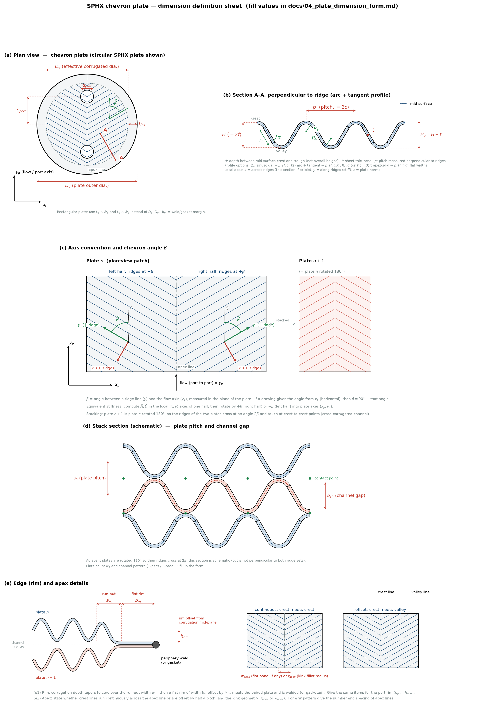

# 04. 전열판 치수 정의 및 입력 양식

쉐브론 전열판의 형상·재질·설계조건을 등가모델 계산에 필요한 형태로 정의한다. 아래 그림의 기호를 기준으로 **값 열을 채워 주면** 그대로 계산 시트(`calc/`)와 FE 모델(`fea/`)의 입력이 된다. 값이 없거나 대외비인 항목은 "미정" 또는 "범위"로 적어도 된다.

(원본: `docs/fig/plate_dimensions.svg`, 생성 스크립트: `docs/fig/make_plate_dimension_figure.py`)

## 0. 최소 필수 항목 (이것만 있어도 계산 모듈 착수 가능)

| 항목 | 기호 | 그림 |
|---|---|---|
| 단면 형식 (사인형 / 원호+접선 / 사다리꼴) | – | (b) |
| 주름 피치, 깊이, 판 두께 | $p, H, t$ | (b) |
| 원호+접선이면 원호 반경과 플랭크 각(또는 접선 길이) | $R_c, R_v, \alpha$ (또는 $T_L$) | (b) |
| 쉐브론 각 (기준축 명시) | $\beta$ | (a), (c) |
| 재질, 설계온도, 판 양면 최대 압력차 | – | D |

## 치수 측정 기준 (공통)

- 모든 단면 치수는 **판 중앙면(mid-surface)** 기준. 도면이 외면 기준이면 그렇게 표시해 주면 변환한다.
- 피치 $p$는 **능선에 수직인 방향**으로 측정한 값. 판 축 방향으로 측정한 값이면 표시해 주면 $p_{axis}\sin\beta$ 등으로 변환한다.
- 쉐브론 각 $\beta$는 **능선과 유동축($y_p$, 포트 연결 방향) 사이 각**. 업계에 따라 수평축 기준($90°-\beta$)으로 표기하므로 기준을 함께 적어 준다.
- 문헌 기호 대응: $p=2c$, $H=2f$, $t=h$, 원호-접선 단면의 $R,\ T_L,\ \alpha$는 Lang & Su Fig. 6 정의와 동일 (`02_literature.md` §1.1).

## A. 평면 형상 — 그림 (a)

| 기호 | 항목 | 단위 | 값 | 비고 |
|---|---|---|---|---|
| 판 형상 | 원형 / 직사각형 / 기타 | – | | SPHX는 보통 원형 |
| $D_p$ (또는 $L_p\times W_p$) | 판 외경 (또는 길이×폭) | mm | | 용접/가스켓 테두리 포함 전체 |
| $D_e$ (또는 $L_e\times W_e$) | 유효 주름 영역 지름 (또는 길이×폭) | mm | | 주름이 형성된 영역 |
| $N_{port}$ | 포트 수 | – | | SPHX는 보통 2 |
| $d_{port}$ | 포트 구멍 지름 | mm | | |
| $e_{port}$ | 판 중심에서 포트 중심까지 거리 | mm | | 포트 간 거리 $=2e_{port}$ |
| 포트 주변 | 포트 주위 무주름(평탄) 영역 지름 또는 분배 패턴 유무 | mm / – | | 있으면 대략 크기 |
| 포트 칼라 | 포트에 보강 링·칼라가 있는지, 있으면 폭·두께 | mm | | 포트 용접부 강성 |
| $\beta$ | 쉐브론 각 (능선–유동축) | ° | | 기준(유동축/수평축) 명시 |
| 판 종류 | 판 종류 수(단일 / A·B 혼합), 종류별 $\beta$ | – | | 열설계상 고·저 β 혼합 여부 |
| 쉐브론 구성 | 단일 V(apex 1개) / 다중 W(apex 여러 개) | – | | 다중이면 apex 수와 간격 |
| 판 배열 | 인접 판 180° 회전 여부 (±β 교차) / 동일 방향 | – | | |

## A-2. 테두리(rim)·용접 — 그림 (e1)  ★ 단일 판 FE 경계조건 결정

| 기호 | 항목 | 단위 | 값 | 비고 |
|---|---|---|---|---|
| 접합 방식 | 외주: 레이저 용접 / 가스켓 / 브레이징 | – | | |
| 접합 구성 | 판 n–n+1은 외주 용접, n+1–n+2는 포트 용접(카세트) 등 교대 구성 설명 | – | | 어느 쌍이 어디서 접합되는지 |
| $b_m$ | 외주 평탄 테두리 폭 | mm | | |
| $h_{rim}$ | 테두리 평면의 주름 중앙면 대비 오프셋 | mm | | 0이면 표시 |
| $w_{ro}$ | 주름 런아웃 폭 (깊이가 0으로 줄어드는 구간) | mm | | 없으면 0 |
| 용접부 | 비드 폭, 맞대기/겹침, 용입 | mm / – | | 국부 응력·경계 강성 |
| $b_{port}$ | 포트 주위 평탄 테두리 폭 | mm | | |
| $h_{port}$ | 포트 테두리 평면 오프셋 | mm | | |
| 포트 접합 | 포트 부 용접/가스켓 형식 | – | | |

## B. 주름 단면 — 그림 (b)

| 기호 | 항목 | 단위 | 값 | 비고 |
|---|---|---|---|---|
| 단면 형식 | (1) 사인형 / (2) 원호+접선 / (3) 사다리꼴 / (4) 기타 | – | | 도면 단면 스케치가 있으면 첨부 |
| $p$ | 주름 피치 (능선 수직 방향, 산–산) | mm | | $=2c$ |
| $H$ | 주름 깊이 (중앙면 산–골) | mm | | $=2f$. 외면 기준이면 $H_o=H+t$ |
| $t$ | 판 두께 (성형 전 소재 두께) | mm | | $=h$ |
| $R_c$ | 산(crest) 원호 반경 (중앙면) | mm | | 단면 (2)·(3)에서 필요 |
| $R_v$ | 골(valley) 원호 반경 (중앙면) | mm | | $R_c\ne R_v$이면 비대칭 단면 → 연성 강성 발생 |
| $\alpha$ | 플랭크(경사부) 각 (수평 기준) | ° | | (2)·(3). $T_L$과 둘 중 하나 |
| $T_L$ | 접선(직선) 구간 길이 | mm | | (2). $\alpha$ 대신 가능 |
| $w_c,\ w_v$ | 산·골 평탄부 폭 | mm | | (3) 사다리꼴만 |
| 공차 | $p, H, t$의 허용 공차 | mm | | 보수적 두께 평가용 |

## B-2. 성형 후 두께 및 apex — 그림 (e2)  ★ 국부 응력 평가

| 기호 | 항목 | 단위 | 값 | 비고 |
|---|---|---|---|---|
| $t_{min}$ | 성형 후 최소 두께와 그 위치(플랭크/산/apex) | mm | | 측정값 또는 성형해석값. 없으면 "미측정" |
| 두께 감소율 | 성형 두께 감소율 또는 분포 | % | | |
| 성형 방식 | 프레스 / 롤 성형, 성형 후 열처리 여부 | – | | 잔류응력·항복강도 변화 |
| apex 연결 | 산–산 연속 / 반피치 어긋남(산–골) | – | | (e2) |
| $r_{apex}$ | apex 꺾임부 필렛 반경 | mm | | 또는 |
| $w_{apex}$ | apex 평탄 띠 폭 | mm | | 있으면 |
| apex 수·간격 | W 패턴이면 apex 선 수와 간격 | – / mm | | |

## C. 적층 — 그림 (d)

| 기호 | 항목 | 단위 | 값 | 비고 |
|---|---|---|---|---|
| $N_p$ | 판 장수 (전열판 총수) | – | | |
| $s_p$ | 판 피치 (인접 판 중앙면 간 거리) | mm | | 접촉 시 $\approx H+t$ |
| $b_{ch}$ | 채널 간극 (유로 높이), 고온측/저온측 | mm | | 다르면 각각 |
| 접촉 | 인접 판 산–산 접촉 여부, 접촉 형태(점/선), 접촉점 용접·브레이징 여부 | – | | 확장 단계(스택 강성)용 |
| 지지 딤플 | 판면에 별도 지지 돔/딤플이 있는지 | – | | |
| 끝판 | 양 끝 판(end plate) 두께·형식 | mm | | |
| 유로 구성 | 1-pass / 2-pass, 플레이트 팩 체결 방식(쉘 내 자유 / 타이로드 / 스페이서) | – | | 경계조건용 |
| 쉘측 | 쉘 내경, 판 팩과 쉘의 연결 방식 | mm | | 2단계 조립체 FE용 |

## D. 재질 및 설계조건

| 항목 | 값 | 비고 |
|---|---|---|
| 판 재질 (규격) | | 예: SA-240 316L, Ti Gr.2, 254SMO |
| 재질 상태 | | 소둔 / 성형 후 열처리 없음(냉간가공) |
| 설계 온도 (판측/쉘측) | °C | |
| 설계 압력 (판측/쉘측) | MPa 또는 bar | |
| 최대 압력차 (판 양면) | MPa | 어느 유체가 고압인지 |
| 고압측 작용 면 | | 판의 산(볼록) 쪽 / 골(오목) 쪽 — 채널 기준으로 설명해도 됨 |
| 판 양면 온도차 | °C | 열응력 검토 시 |
| 시험 압력 | MPa | 수압시험 조건 |
| 압력 사이클 | 회 | 피로 검토 필요 여부 |
| 적용 코드 | | ASME VIII Div.1 / Div.2, EN 13445, 사내 기준 |
| 부식 여유 | mm | 있으면 |
| 하중 케이스 우선순위 | | 압력차만 / 열하중 포함 / 체결력 포함 |
| 기존 해석·시험 자료 | | 상세 FE 결과, 파열시험, 변형 측정 |

## E. 해석 환경

| 항목 | 값 | 비고 |
|---|---|---|
| ANSYS 버전 | | 예: 2024 R2 |
| 사용 인터페이스 | | Workbench Mechanical / MAPDL / 둘 다 |
| 쉘 요소 선호 | | SHELL181 / SHELL281 |
| 엑셀 계산서 양식 | | 있으면 파일 첨부 |
| 단위계 | | mm-N-MPa 권장 |

---

**작성 후 처리 순서**: 이 양식 값 확정 → B-1 형상 파라미터 정의서(`docs/05_geometry_parameters.md`, 예정)에 반영 → `calc/` 계산 모듈의 입력 파일(`calc/plate_input.yaml`, 예정)로 변환.
