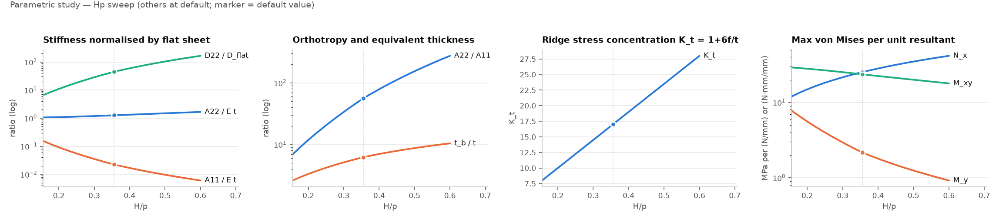
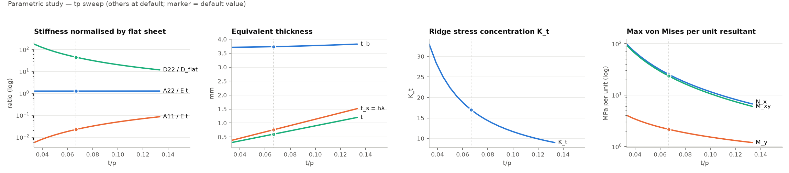
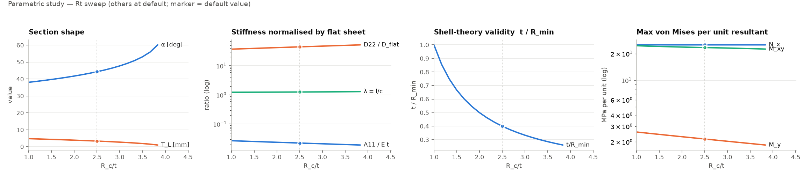
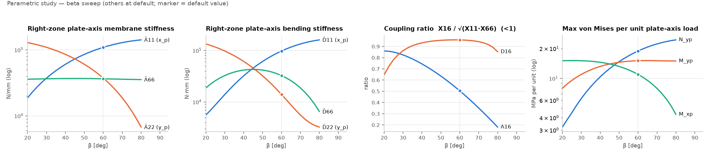

# 11. 파라메트릭 스터디 (C-3) — 형상 비와 쉐브론 각이 등가 강성·응력에 미치는 영향

**목적**: 두께 사이징에서 어느 형상 인자가 지배적인지 파악하고, 등가 판 FE 입력의 β 의존성을 정량화한다. 기준은 05 §5 가정 기본값(원호+접선 $p=9$, $H=3.2$, $t=0.6$, $R_c=R_v=1.5$ mm, 316L, $\beta=60°$)이며 한 번에 한 변수만 바꾼다.

**산출**: `calc/parametric.py` → `docs/param_study/sweep_{Hp,tp,Rt,beta}.csv`(케이스별 전 출력량), `docs/fig/param_{Hp,tp,Rt,beta}.png`(4패널 경향 그림, 점 = 기본값). 응력 응답은 국부축 단위 합력(1 N/mm 또는 1 N·mm/mm)에 대한 VAM 복원 최대 von Mises [MPa]로 나타낸다(09 §3.3 확장).

---

## 1. 깊이 비 $H/p$ (0.15 – 0.6; $R_c/H$ = 0.469 유지)

| $H/p$ | 0.20 | **0.356** | 0.50 |
|---|---|---|---|
| $A_{22}/A_{11}$ | 11.9 | 56.2 | 154 |
| $t_b/t$ | 3.33 | 6.22 | 8.75 |
| $K_t=1+6f/t$ | 10.0 | 17.0 | 23.5 |
| max σ_vM per $N_x$ [MPa/(N/mm)] | 14.9 | 25.3 | 34.9 |
| max σ_vM per $M_y$ [MPa/(N·mm/mm)] | 5.57 | 2.16 | 1.25 |
| max σ_vM per $M_{xy}$ | 28.0 | 23.6 | 20.0 |

- 깊이가 커지면 능선 방향 강성은 거의 그대로($A_{22}\approx Eh\lambda$)이고 가로 강성 $A_{11}$이 $1/J_2\sim1/H^2$로 급감한다. 직교이방성 비 $A_{22}/A_{11}$은 $H/p$ 0.2→0.5에서 13배 커진다.
- 능선 가로 인장 $N_x$의 응력집중 $K_t=1+3H/t$가 선형으로 커지고, 단위 $N_x$당 응력도 거의 같은 비율로 커진다. 반대로 능선 방향 굽힘 $M_y$는 깊이가 클수록 유리하다($D_{22}\propto H^2$).
- 등가 굽힘 두께 $t_b$는 $H$에 거의 비례한다($t_b\approx\sqrt{J_2/\lambda}$, §2 참조).

## 2. 두께 비 $t/p$ (0.033 – 0.133; 형상 고정)

| $t/p$ | 0.044 | **0.0667** | 0.10 |
|---|---|---|---|
| $A_{22}/A_{11}$ | 128 | 56.2 | 25.6 |
| $K_t$ | 25.3 | 17.0 | 11.7 |
| $t_b$ [mm] | 3.72 | 3.73 | 3.77 |
| max σ_vM per $N_x$ | 57.0 | 25.3 | 11.6 |
| max σ_vM per $M_y$ | 3.13 | 2.16 | 1.52 |
| max σ_vM per $M_{xy}$ | 53.8 | 23.6 | 10.6 |

- **등가 굽힘 두께 $t_b$는 원판 두께와 거의 무관하다**(0.3→1.2 mm에서 3.72→3.77). $t_b^2=(12J_2+h^2J_1)/(12\lambda)$에서 $h^2J_1$ 항이 $12J_2$의 2 %에 불과하므로 $t_b\approx\sqrt{J_2/\lambda}$, 즉 순수 형상량이다. 등가 판 FE의 "두께"는 판재 두께가 아니라 주름 깊이가 정한다.
- 단위 $N_x$·$M_{xy}$당 응력은 $t^{-2}$에 가깝게 감소한다(막 성분 $1/t$ × $K_t\approx 3H/t$). 단위 $M_y$당 응력은 $t^{-0.9}$로 완만하다. 즉 **두께 증가는 가로 인장·비틀림 응력에 효과적이고 능선 방향 굽힘에는 덜 효과적**이다.
- $A_{22}/A_{11}\propto t^{-2}$: 얇은 판일수록 직교이방성이 극단적이 되어 등가 판 FE 조건수에 주의(09 §2).

## 3. 능선 반경 비 $R_c/t$ (1.0 – 3.9; $p, H, t$ 고정)

| $R_c/t$ | 1.5 | **2.5** | 4.0 |
|---|---|---|---|
| α [°] | 39.7 | 44.3 | 60.2 |
| $A_{11}/(Et)$ | 0.0254 | 0.0225 | 0.0192 |
| $D_{22}/D_{flat}$ | 39.5 | 44.6 | 52.1 |
| $t/R_{min}$ | 0.667 | 0.400 | 0.261 |
| max σ_vM per $N_x$ | 25.3 | 25.3 | 25.3 |
| max σ_vM per $M_{xy}$ | 24.2 | 23.6 | 22.6 |

- $p, H, t$가 같으면 반경은 강성에 2차 인자다: $R_c/t$ 1.5→4에서 $A_{11}$ −24 %, $D_{22}$ +32 %, 응력 응답은 ±4 % 이내. 등가 판 관점에서 **반경은 정밀 측정 우선순위가 낮다**.
- 반경이 중요한 곳은 다른 데 있다. (i) $t/R_{min}$이 쉘 이론 한계 0.2를 넘는지(기본값 0.4, $R_c=2.4t$ 이하면 0.4 초과) — 능선 국부 응력의 두께 방향 분포와 성형 두께 감소는 반경에 지배된다(09 §5, D단계 솔리드 FE). (ii) $R_c \ge 2.4$ mm에서는 접선 구간이 사라져 원호+접선 단면이 성립하지 않는다(생성 시 스킵된 3케이스).

## 4. 쉐브론 각 β (20 – 80°; 우측 영역 판축 강성과 판축 단위 하중 응답)

| β [°] | 30 | 45 | **60** | 75 |
|---|---|---|---|---|
| $\bar A_{11}$ ($x_p$) [N/mm] | 37 400 | 72 900 | 109 300 | 136 400 |
| $\bar A_{22}$ ($y_p$, 유동축) | 109 300 | 72 900 | 37 400 | 11 800 |
| $\bar A_{66}$ | 36 500 | 36 900 | 36 500 | 35 700 |
| $\bar D_{11}$ [N·mm] | 13 900 | 45 400 | 97 500 | 148 600 |
| $\bar D_{22}$ | 97 500 | 45 400 | 13 900 | 3 930 |
| $\bar D_{66}$ | 32 500 | 42 800 | 32 500 | 12 000 |
| $\bar A_{16}/\sqrt{\bar A_{11}\bar A_{66}}$ | 0.82 | 0.69 | 0.50 | 0.27 |
| $\bar D_{16}/\sqrt{\bar D_{11}\bar D_{66}}$ | 0.86 | 0.95 | **0.96** | 0.92 |
| max σ_vM per $N_{y_p}$ (유동축 인장) | 6.3 | 12.6 | 18.9 | 23.6 |
| max σ_vM per $M_{y_p}$ (유동축 굽힘) | 11.0 | 14.0 | 15.1 | 15.0 |
| max σ_vM per $M_{x_p}$ | 15.1 | 14.0 | 11.0 | 6.2 |

- β가 클수록(능선이 유동축에서 멀어질수록) 유동축 방향 $y_p$의 막·굽힘 강성이 급감하고($\bar A_{22}$ 30°→75°에서 1/9, $\bar D_{22}$ 1/25), 유동축 인장 $N_{y_p}$에 대한 응력이 4배 커진다. β=45°에서 두 판축이 대칭이다.
- **굽힘–비틀림 연성 $\bar D_{16}$은 β 30–75° 전 범위에서 $\sqrt{\bar D_{11}\bar D_{66}}$의 0.86–0.96**으로 양정치 한계(1)에 근접한다. 즉 판축 굽힘 $M_{x_p}$만 걸어도 영역은 거의 같은 크기의 비틀림 곡률을 갖는다. 등가 판 FE에서 16/26 항을 빼고(직교이방 근사) 입력하면 굽힘 거동이 정성적으로 틀리며, 07 §4·09 §2의 zone-wise GENS 입력 결정을 재확인한다.
- 유동축 굽힘 $M_{y_p}$에 대한 응력은 β 45° 이상에서 거의 일정(14–15 MPa per N·mm/mm)하다. 이 값은 "영역이 판축 모멘트를 그대로 받는다"는 가정이며, 실제 분배는 E단계 FE로 확인한다(10 §5).

## 5. 두께 사이징 관점 요약

| 인자 | 응력에 미치는 영향 (단위 하중당) | 설계 함의 |
|---|---|---|
| 판 두께 $t$ | $N_x$, $M_{xy}$ 응력 $\propto t^{-2}$; $M_y$ 응력 $\propto t^{-0.9}$ | 두께 증가는 가로 인장·비틀림 지배 하중에 효과적. 등가 판 두께 $t_b$는 변하지 않음 |
| 깊이 $H$ | $K_t=1+3H/t$ 선형 증가; $M_y$ 응력은 감소 | 깊이는 열전달·압력손실로 정해지므로 응력 측에서는 $H/t$가 두께를 지배 |
| 반경 $R_c$ | 강성·응력 ±4 % | 등가 모델 입력 정밀도 요구 낮음. 다만 $t/R_{min}>0.2$ 판정과 성형 두께 감소는 반경이 지배 |
| 각도 β | 유동축 강성 $\bar A_{22},\bar D_{22}$ 급감; $\bar D_{16}$ 연성 0.9 수준 | β는 열수력으로 정해지지만, 등가 판 FE에서는 16/26 항 필수, 유동축 하중 응력은 β에 민감 |

**우선 확보할 실제 치수**: $t$(및 성형 후 $t_{min}$), $H$, $p$, β 순. $R_c, R_v$는 $t/R$ 판정용으로만 필요하다.

## 6. 한계

- 원호+접선 대칭 단면, 채택식(VAM), 산·골·플랭크 선형 응력 복원 범위 안의 결과다. apex·테두리 보정, 좌굴, 접촉은 포함하지 않는다(08 §2).
- 판축 단위 하중 응답(§4)은 영역 단독 응답이며 ±β 영역 간 하중 재분배를 반영하지 않는다.
- $H/p>0.5$, $t/p<0.04$ 영역은 문헌 검증 범위 밖으로 경향 참고용이다.
